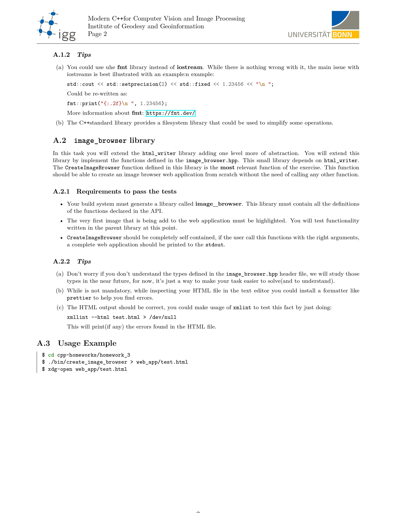

### Homework #3:
___

___

___
### Solutions
html library writer: 
1. Clone the repo
2. `cd` to `homework_3`
3. Run `./install.sh` 
    * This will creat the `Saeed_html_file.html` inside the `web_app` folder.

---
*Some useful links that you might check before/while solving the homework:*

[Great Youtube playlist about pointers.](https://www.youtube.com/playlist?list=PL2_aWCzGMAwLZp6LMUKI3cc7pgGsasm2_)

[Magic numbers and why they are bad!](https://stackoverflow.com/questions/47882/what-is-a-magic-number-and-why-is-it-bad)

[How to iterate over a vector?](https://stackoverflow.com/questions/12702561/iterate-through-a-c-vector-using-a-for-loop)

[Retrive values from tuple.](https://stackoverflow.com/questions/15835762/how-to-get-reference-to-an-element-of-a-stdtuple)

[+ operator for strings.](http://www.cplusplus.com/reference/string/string/operator+=/)

[How to change a string at particular index?](https://stackoverflow.com/questions/18305844/c-best-way-to-change-a-string-at-a-particular-index)

[How to change int variable to string?](https://stackoverflow.com/questions/5590381/easiest-way-to-convert-int-to-string-in-c)

[Push back vs emplace back.](https://stackoverflow.com/questions/4303513/push-back-vs-emplace-back)
