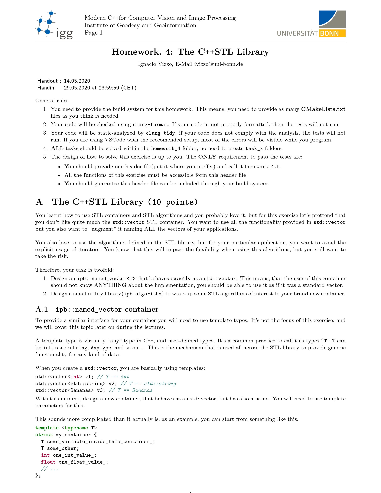
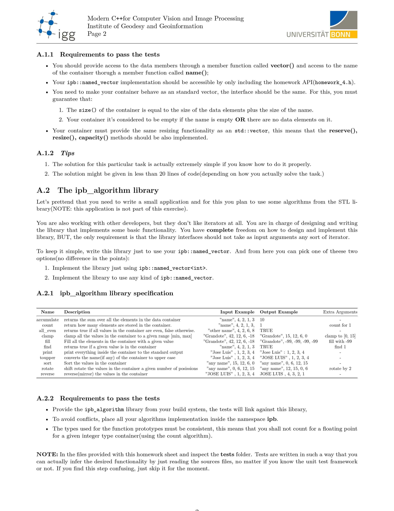

### Homework #4:
___

___

___
### Solutions
<!-- html library writer: 
1. Clone the repo
2. `cd` to `homework_3`
3. Run `./install.sh` 
    * This will creat the `Saeed_html_file.html` inside the `web_app` folder. -->

---
*Some useful links that you might check before/while solving the homework:*

